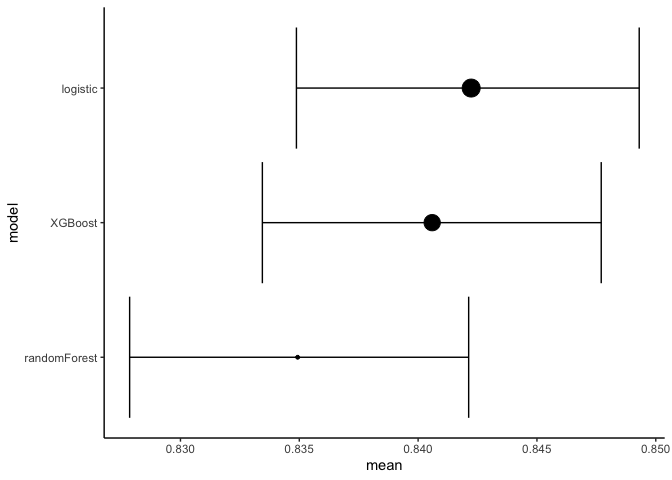

Bayesian Machine Learning
================

``` r
library(tidyverse)
library(tidymodels)
library(tidyposterior)
library(tidytext)
theme_set(theme_classic())
```

Based on
:[Andrew-couch](https://github.com/andrew-couch/Tidy-Tuesday/blob/master/TidyTuesdayModelEval.Rmd)

``` r
df <- read_csv("../data/WA_Fn-UseC_-Telco-Customer-Churn.csv")
df <- df %>% drop_na()
df %>% summary()
```

    ##   customerID           gender          SeniorCitizen      Partner         
    ##  Length:7032        Length:7032        Min.   :0.0000   Length:7032       
    ##  Class :character   Class :character   1st Qu.:0.0000   Class :character  
    ##  Mode  :character   Mode  :character   Median :0.0000   Mode  :character  
    ##                                        Mean   :0.1624                     
    ##                                        3rd Qu.:0.0000                     
    ##                                        Max.   :1.0000                     
    ##   Dependents            tenure      PhoneService       MultipleLines     
    ##  Length:7032        Min.   : 1.00   Length:7032        Length:7032       
    ##  Class :character   1st Qu.: 9.00   Class :character   Class :character  
    ##  Mode  :character   Median :29.00   Mode  :character   Mode  :character  
    ##                     Mean   :32.42                                        
    ##                     3rd Qu.:55.00                                        
    ##                     Max.   :72.00                                        
    ##  InternetService    OnlineSecurity     OnlineBackup       DeviceProtection  
    ##  Length:7032        Length:7032        Length:7032        Length:7032       
    ##  Class :character   Class :character   Class :character   Class :character  
    ##  Mode  :character   Mode  :character   Mode  :character   Mode  :character  
    ##                                                                             
    ##                                                                             
    ##                                                                             
    ##  TechSupport        StreamingTV        StreamingMovies      Contract        
    ##  Length:7032        Length:7032        Length:7032        Length:7032       
    ##  Class :character   Class :character   Class :character   Class :character  
    ##  Mode  :character   Mode  :character   Mode  :character   Mode  :character  
    ##                                                                             
    ##                                                                             
    ##                                                                             
    ##  PaperlessBilling   PaymentMethod      MonthlyCharges    TotalCharges   
    ##  Length:7032        Length:7032        Min.   : 18.25   Min.   :  18.8  
    ##  Class :character   Class :character   1st Qu.: 35.59   1st Qu.: 401.4  
    ##  Mode  :character   Mode  :character   Median : 70.35   Median :1397.5  
    ##                                        Mean   : 64.80   Mean   :2283.3  
    ##                                        3rd Qu.: 89.86   3rd Qu.:3794.7  
    ##                                        Max.   :118.75   Max.   :8684.8  
    ##     Churn          
    ##  Length:7032       
    ##  Class :character  
    ##  Mode  :character  
    ##                    
    ##                    
    ## 

``` r
df <- df %>% 
  mutate_at(vars(-MonthlyCharges,-TotalCharges, -tenure), as.factor) %>%
  mutate_at(vars(tenure, MonthlyCharges, TotalCharges), as.numeric)

df%>%
  head()
```

    ## # A tibble: 6 x 21
    ##   customerID gender SeniorCitizen Partner Dependents tenure PhoneService
    ##   <fct>      <fct>  <fct>         <fct>   <fct>       <dbl> <fct>       
    ## 1 7590-VHVEG Female 0             Yes     No              1 No          
    ## 2 5575-GNVDE Male   0             No      No             34 Yes         
    ## 3 3668-QPYBK Male   0             No      No              2 Yes         
    ## 4 7795-CFOCW Male   0             No      No             45 No          
    ## 5 9237-HQITU Female 0             No      No              2 Yes         
    ## 6 9305-CDSKC Female 0             No      No              8 Yes         
    ## # … with 14 more variables: MultipleLines <fct>, InternetService <fct>,
    ## #   OnlineSecurity <fct>, OnlineBackup <fct>, DeviceProtection <fct>,
    ## #   TechSupport <fct>, StreamingTV <fct>, StreamingMovies <fct>,
    ## #   Contract <fct>, PaperlessBilling <fct>, PaymentMethod <fct>,
    ## #   MonthlyCharges <dbl>, TotalCharges <dbl>, Churn <fct>

## Machine Learning

``` r
set.seed(42)
tidy_split <- initial_split(df, prop = .8, strata = Churn)
train_data <- training(tidy_split)
test_data <- testing(tidy_split)
tidy_k_folds <- vfold_cv(train_data)
tidy_rec <- recipe(Churn~., data = train_data) %>% 
  step_rm(customerID) %>% 
  step_normalize(all_numeric()) %>% 
  step_dummy(all_nominal(), -all_outcomes())
```

``` r
baseline_model <- logistic_reg() %>% 
  set_mode("classification") %>% 
  set_engine("glm")
randomForest_model <- rand_forest() %>% 
  set_mode("classification") %>% 
  set_engine("randomForest")
XGBoost_model <- boost_tree() %>% 
  set_mode("classification") %>% 
  set_engine("xgboost")

logistic_res <- fit_resamples(baseline_model, tidy_rec, tidy_k_folds)
randomForest_res <- fit_resamples(randomForest_model, tidy_rec, tidy_k_folds)
XGBoost_res <- fit_resamples(XGBoost_model, tidy_rec, tidy_k_folds)

model_res <- tibble(model = list(logistic_res, randomForest_res, XGBoost_res),
       model_name = c("logistic", "randomForest", "XGBoost"))

map_collect_metrics <- function(model){
  
  model %>% 
    select(id, .metrics) %>% 
    unnest()
}

model_res <- model_res %>% 
  mutate(res = map(model, map_collect_metrics)) %>% 
  select(model_name, res) %>% 
  unnest(res)
```

``` r
model_res %>% 
  mutate(model_name=reorder_within(model_name,.estimate,.metric))%>%
  ggplot(aes(x = model_name, y = .estimate, fill=model_name, color=model_name)) + 
  geom_boxplot(alpha=0.5, show.legend = FALSE) + 
  facet_wrap(~.metric, scales = "free")+
  scale_x_reordered()
```

<!-- -->

``` r
model_res %>% 
  ggplot(aes(x = .estimate, color = model_name, fill = model_name)) + 
  geom_density(alpha = .1) + 
  facet_wrap(~.metric, scales = "free_y")
```

<!-- -->

``` r
model_res %>% 
  group_by(model_name, .metric) %>% 
  summarise(mean = mean(.estimate))
```

    ## # A tibble: 6 x 3
    ## # Groups:   model_name [3]
    ##   model_name   .metric   mean
    ##   <chr>        <chr>    <dbl>
    ## 1 logistic     accuracy 0.800
    ## 2 logistic     roc_auc  0.842
    ## 3 randomForest accuracy 0.799
    ## 4 randomForest roc_auc  0.835
    ## 5 XGBoost      accuracy 0.798
    ## 6 XGBoost      roc_auc  0.841

``` r
model_pos <- model_res %>% 
  filter(.metric == "roc_auc") %>% 
  select(model_name, id, .estimate) %>% 
  pivot_wider(names_from = "model_name", values_from = ".estimate")

model_pos
```

    ## # A tibble: 10 x 4
    ##    id     logistic randomForest XGBoost
    ##    <chr>     <dbl>        <dbl>   <dbl>
    ##  1 Fold01    0.855        0.851   0.856
    ##  2 Fold02    0.823        0.819   0.822
    ##  3 Fold03    0.841        0.837   0.844
    ##  4 Fold04    0.834        0.814   0.817
    ##  5 Fold05    0.844        0.837   0.847
    ##  6 Fold06    0.831        0.829   0.835
    ##  7 Fold07    0.852        0.851   0.854
    ##  8 Fold08    0.858        0.856   0.862
    ##  9 Fold09    0.834        0.818   0.827
    ## 10 Fold10    0.853        0.840   0.843

``` r
roc_auc_model <- perf_mod(model_pos, seed = 42)
```

    ## 
    ## SAMPLING FOR MODEL 'continuous' NOW (CHAIN 1).
    ## Chain 1: 
    ## Chain 1: Gradient evaluation took 0.000134 seconds
    ## Chain 1: 1000 transitions using 10 leapfrog steps per transition would take 1.34 seconds.
    ## Chain 1: Adjust your expectations accordingly!
    ## Chain 1: 
    ## Chain 1: 
    ## Chain 1: Iteration:    1 / 2000 [  0%]  (Warmup)
    ## Chain 1: Iteration:  200 / 2000 [ 10%]  (Warmup)
    ## Chain 1: Iteration:  400 / 2000 [ 20%]  (Warmup)
    ## Chain 1: Iteration:  600 / 2000 [ 30%]  (Warmup)
    ## Chain 1: Iteration:  800 / 2000 [ 40%]  (Warmup)
    ## Chain 1: Iteration: 1000 / 2000 [ 50%]  (Warmup)
    ## Chain 1: Iteration: 1001 / 2000 [ 50%]  (Sampling)
    ## Chain 1: Iteration: 1200 / 2000 [ 60%]  (Sampling)
    ## Chain 1: Iteration: 1400 / 2000 [ 70%]  (Sampling)
    ## Chain 1: Iteration: 1600 / 2000 [ 80%]  (Sampling)
    ## Chain 1: Iteration: 1800 / 2000 [ 90%]  (Sampling)
    ## Chain 1: Iteration: 2000 / 2000 [100%]  (Sampling)
    ## Chain 1: 
    ## Chain 1:  Elapsed Time: 1.37801 seconds (Warm-up)
    ## Chain 1:                0.217531 seconds (Sampling)
    ## Chain 1:                1.59554 seconds (Total)
    ## Chain 1: 
    ## 
    ## SAMPLING FOR MODEL 'continuous' NOW (CHAIN 2).
    ## Chain 2: 
    ## Chain 2: Gradient evaluation took 2e-05 seconds
    ## Chain 2: 1000 transitions using 10 leapfrog steps per transition would take 0.2 seconds.
    ## Chain 2: Adjust your expectations accordingly!
    ## Chain 2: 
    ## Chain 2: 
    ## Chain 2: Iteration:    1 / 2000 [  0%]  (Warmup)
    ## Chain 2: Iteration:  200 / 2000 [ 10%]  (Warmup)
    ## Chain 2: Iteration:  400 / 2000 [ 20%]  (Warmup)
    ## Chain 2: Iteration:  600 / 2000 [ 30%]  (Warmup)
    ## Chain 2: Iteration:  800 / 2000 [ 40%]  (Warmup)
    ## Chain 2: Iteration: 1000 / 2000 [ 50%]  (Warmup)
    ## Chain 2: Iteration: 1001 / 2000 [ 50%]  (Sampling)
    ## Chain 2: Iteration: 1200 / 2000 [ 60%]  (Sampling)
    ## Chain 2: Iteration: 1400 / 2000 [ 70%]  (Sampling)
    ## Chain 2: Iteration: 1600 / 2000 [ 80%]  (Sampling)
    ## Chain 2: Iteration: 1800 / 2000 [ 90%]  (Sampling)
    ## Chain 2: Iteration: 2000 / 2000 [100%]  (Sampling)
    ## Chain 2: 
    ## Chain 2:  Elapsed Time: 1.18252 seconds (Warm-up)
    ## Chain 2:                0.238669 seconds (Sampling)
    ## Chain 2:                1.42119 seconds (Total)
    ## Chain 2: 
    ## 
    ## SAMPLING FOR MODEL 'continuous' NOW (CHAIN 3).
    ## Chain 3: 
    ## Chain 3: Gradient evaluation took 1.9e-05 seconds
    ## Chain 3: 1000 transitions using 10 leapfrog steps per transition would take 0.19 seconds.
    ## Chain 3: Adjust your expectations accordingly!
    ## Chain 3: 
    ## Chain 3: 
    ## Chain 3: Iteration:    1 / 2000 [  0%]  (Warmup)
    ## Chain 3: Iteration:  200 / 2000 [ 10%]  (Warmup)
    ## Chain 3: Iteration:  400 / 2000 [ 20%]  (Warmup)
    ## Chain 3: Iteration:  600 / 2000 [ 30%]  (Warmup)
    ## Chain 3: Iteration:  800 / 2000 [ 40%]  (Warmup)
    ## Chain 3: Iteration: 1000 / 2000 [ 50%]  (Warmup)
    ## Chain 3: Iteration: 1001 / 2000 [ 50%]  (Sampling)
    ## Chain 3: Iteration: 1200 / 2000 [ 60%]  (Sampling)
    ## Chain 3: Iteration: 1400 / 2000 [ 70%]  (Sampling)
    ## Chain 3: Iteration: 1600 / 2000 [ 80%]  (Sampling)
    ## Chain 3: Iteration: 1800 / 2000 [ 90%]  (Sampling)
    ## Chain 3: Iteration: 2000 / 2000 [100%]  (Sampling)
    ## Chain 3: 
    ## Chain 3:  Elapsed Time: 1.33245 seconds (Warm-up)
    ## Chain 3:                0.267276 seconds (Sampling)
    ## Chain 3:                1.59972 seconds (Total)
    ## Chain 3: 
    ## 
    ## SAMPLING FOR MODEL 'continuous' NOW (CHAIN 4).
    ## Chain 4: 
    ## Chain 4: Gradient evaluation took 2.4e-05 seconds
    ## Chain 4: 1000 transitions using 10 leapfrog steps per transition would take 0.24 seconds.
    ## Chain 4: Adjust your expectations accordingly!
    ## Chain 4: 
    ## Chain 4: 
    ## Chain 4: Iteration:    1 / 2000 [  0%]  (Warmup)
    ## Chain 4: Iteration:  200 / 2000 [ 10%]  (Warmup)
    ## Chain 4: Iteration:  400 / 2000 [ 20%]  (Warmup)
    ## Chain 4: Iteration:  600 / 2000 [ 30%]  (Warmup)
    ## Chain 4: Iteration:  800 / 2000 [ 40%]  (Warmup)
    ## Chain 4: Iteration: 1000 / 2000 [ 50%]  (Warmup)
    ## Chain 4: Iteration: 1001 / 2000 [ 50%]  (Sampling)
    ## Chain 4: Iteration: 1200 / 2000 [ 60%]  (Sampling)
    ## Chain 4: Iteration: 1400 / 2000 [ 70%]  (Sampling)
    ## Chain 4: Iteration: 1600 / 2000 [ 80%]  (Sampling)
    ## Chain 4: Iteration: 1800 / 2000 [ 90%]  (Sampling)
    ## Chain 4: Iteration: 2000 / 2000 [100%]  (Sampling)
    ## Chain 4: 
    ## Chain 4:  Elapsed Time: 1.93922 seconds (Warm-up)
    ## Chain 4:                0.231779 seconds (Sampling)
    ## Chain 4:                2.171 seconds (Total)
    ## Chain 4:

``` r
roc_auc_model %>% 
  tidy() %>% 
  ggplot(aes(x = model, y = statistic)) + 
  geom_point(alpha = .2, col = "blue")
```

<!-- -->

``` r
contrast_models(roc_auc_model)
```

    ## # Posterior samples of performance differences
    ## # A tibble: 12,000 x 4
    ##    difference model_1  model_2      contrast                 
    ##         <dbl> <chr>    <chr>        <chr>                    
    ##  1    0.00744 logistic randomForest logistic vs. randomForest
    ##  2    0.00608 logistic randomForest logistic vs. randomForest
    ##  3    0.00552 logistic randomForest logistic vs. randomForest
    ##  4    0.00701 logistic randomForest logistic vs. randomForest
    ##  5    0.00753 logistic randomForest logistic vs. randomForest
    ##  6    0.00626 logistic randomForest logistic vs. randomForest
    ##  7    0.00574 logistic randomForest logistic vs. randomForest
    ##  8    0.00529 logistic randomForest logistic vs. randomForest
    ##  9    0.00707 logistic randomForest logistic vs. randomForest
    ## 10    0.00738 logistic randomForest logistic vs. randomForest
    ## # … with 11,990 more rows

``` r
contrast_models(roc_auc_model) %>% 
  ggplot()
```

<!-- -->

``` r
summary(roc_auc_model%>%
          tidy())%>%
  mutate(model=fct_reorder(model,mean))%>%
  ggplot(aes(mean,model))+
  geom_errorbarh(aes(xmin=lower,xmax=upper))+
  geom_point(aes(size=mean),show.legend = FALSE)
```

<!-- -->

``` r
summary(roc_auc_model%>%
          tidy())%>%
  mutate(diff=upper-lower)%>%
  arrange(desc(diff))
```

    ## # A tibble: 3 x 5
    ##   model         mean lower upper   diff
    ##   <chr>        <dbl> <dbl> <dbl>  <dbl>
    ## 1 logistic     0.842 0.835 0.849 0.0144
    ## 2 randomForest 0.835 0.828 0.842 0.0143
    ## 3 XGBoost      0.841 0.833 0.848 0.0143
