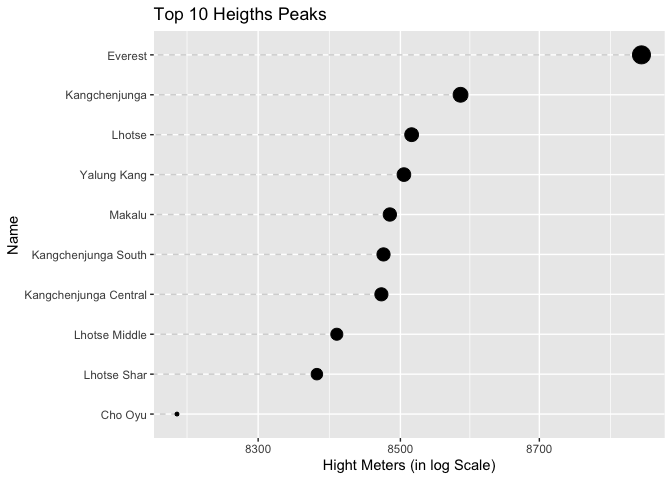
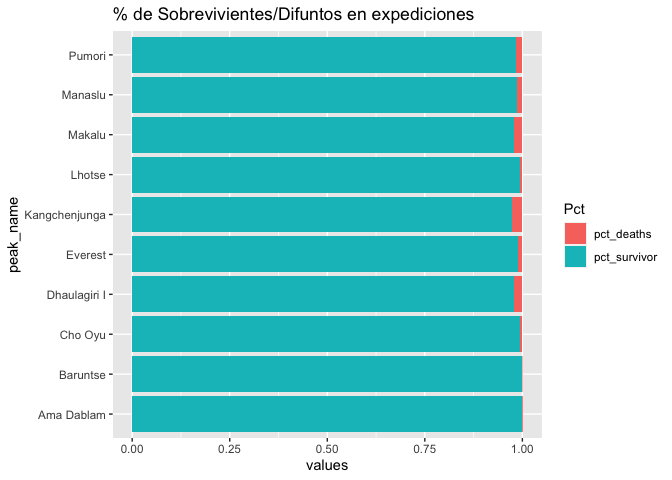
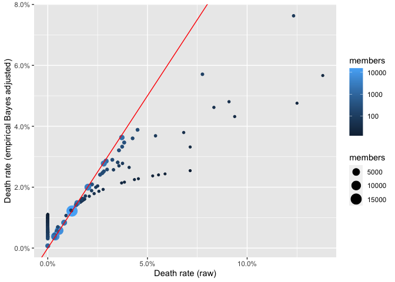
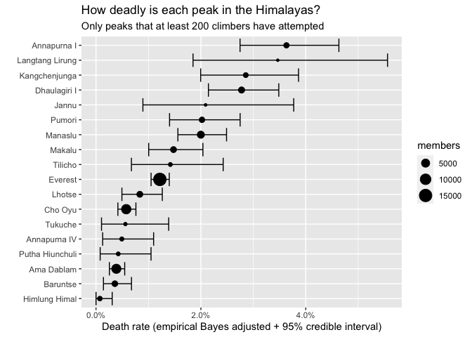

Empirical Bayesian Data Analysis
================

Insipred by
:[Tidytuesday](https://github.com/rfordatascience/tidytuesday/blob/master/data/2020/2020-09-22/readme.md)

## Onboarding

The Himalayan Database is a compilation of records for all expeditions
that have climbed in the Nepal Himalaya. The database is based on the
expedition archives of Elizabeth Hawley, a longtime journalist based in
Kathmandu, and it is supplemented by information gathered from books,
alpine journals and correspondence with Himalayan climbers.

The data cover all expeditions from 1905 through Spring 2019 to more
than 465 significant peaks in Nepal. Also included are expeditions to
both sides of border peaks such as Everest, Cho Oyu, Makalu and
Kangchenjunga as well as to some smaller border peaks. Data on
expeditions to trekking peaks are included for early attempts, first
ascents and major accidents.\[1\]

``` r
library(tidytuesdayR)
library(tidyverse)
library(ebbr)
```

``` r
members <- readr::read_csv('https://raw.githubusercontent.com/rfordatascience/tidytuesday/master/data/2020/2020-09-22/members.csv')
expeditions <- readr::read_csv('https://raw.githubusercontent.com/rfordatascience/tidytuesday/master/data/2020/2020-09-22/expeditions.csv')
peaks <- readr::read_csv('https://raw.githubusercontent.com/rfordatascience/tidytuesday/master/data/2020/2020-09-22/peaks.csv')
```

``` r
summarize_expeditions <- function(tbl) {
  tbl %>%
    summarize(n_climbs = n(),
              pct_success = mean(success == "Success"),
              across(members:hired_staff_deaths, sum),
              first_climb = min(year)) %>%
    mutate(pct_death = member_deaths / members,
         pct_hired_staff_deaths = hired_staff_deaths / hired_staff)
}
```

``` r
peaks<-peaks %>%
  rename(height_meters = height_metres)
peaks%>%
  filter(climbing_status=='Climbed')%>%
  group_by(peak_name)%>%
  summarize(height_meters=mean(height_meters))%>%
  mutate(peak_name=fct_reorder(peak_name,height_meters))%>%
  top_n(10)%>%
  ggplot(aes(height_meters,peak_name))+
  geom_errorbarh(aes(xmin=0,xmax=height_meters), height = 0,linetype = "dashed", alpha=0.2)+
  geom_point(aes(size=height_meters),show.legend = FALSE)+
  scale_x_log10()+
  labs(title = 'Top 10 Heigths Peaks',
       y='Name',
       x='Hight Meters (in log Scale)')
```

<!-- -->

``` r
na_reasons <- c("Unknown", "Attempt rumoured", "Did not attempt climb", "Did not reach base camp")
expeditions <- expeditions %>%
  mutate(success = case_when(str_detect(termination_reason, "Success") ~ "Success",
                             termination_reason %in% na_reasons ~ "Other",
                             TRUE ~ "Failure")) %>%
  mutate(days_to_highpoint = as.integer(highpoint_date - basecamp_date))

expeditions %>%
  filter(!is.na(days_to_highpoint), !is.na(peak_name)) %>%
  filter(success == "Success") %>%
  group_by(peak_name)%>%
  summarize(n_climb=n(),
            members = sum(members),
            member_deaths = sum(member_deaths),
            pct_deaths=member_deaths/members,
            pct_survivor=1-pct_deaths)%>%
  ungroup()%>%
  filter(n_climb>5)%>%
  arrange(desc(members))%>%
  pivot_longer(cols =pct_deaths:pct_survivor,names_to="Pct",values_to='values')%>%
  head(20)%>%
  ggplot(aes(values,peak_name,fill=Pct))+
  geom_bar(stat='identity')+
  labs(title = '% de Sobrevivientes/Difuntos en expediciones')
```

<!-- -->

``` r
peaks_summarized <- expeditions %>%
  group_by(peak_id, peak_name) %>%
  summarize_expeditions() %>%
  ungroup() %>%
  arrange(desc(n_climbs)) %>%
  inner_join(peaks %>% select(peak_id, height_meters), by = "peak_id")
```

``` r
library(ebbr)
library(scales)
peaks_eb <- peaks_summarized %>%
  filter(members >= 13) %>%
  arrange(desc(pct_death)) %>%
  add_ebb_estimate(member_deaths, members)
peaks_eb %>%
  ggplot(aes(pct_death, .fitted)) +
  geom_point(aes(size = members, color = members)) +
  geom_abline(color = "red") +
  scale_x_continuous(labels = percent) +
  scale_y_continuous(labels = percent) +
  scale_color_continuous(trans = "log10") +
  labs(x = "Death rate (raw)",
       y = "Death rate (empirical Bayes adjusted)")
```

<!-- -->

``` r
peaks_eb %>%
  filter(members >= 300) %>%
  arrange(desc(.fitted)) %>%
  mutate(peak_name = fct_reorder(peak_name, .fitted)) %>%
  ggplot(aes(.fitted, peak_name)) +
  geom_point(aes(size = members)) +
  geom_errorbarh(aes(xmin = .low, xmax = .high)) +
  expand_limits(x = 0) +
  scale_x_continuous(labels = percent) +
  labs(x = "Death rate (empirical Bayes adjusted + 95% credible interval)",
       y = "",
       title = "How deadly is each peak in the Himalayas?",
       subtitle = "Only peaks that at least 200 climbers have attempted")
```

<!-- -->

1.  <https://github.com/rfordatascience/tidytuesday/blob/master/data/2020/2020-09-22/readme.md>
